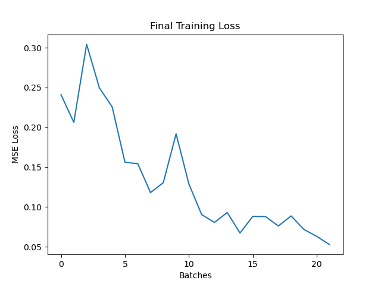

# building-efficiency-utility

Predicting energy performance of buildings (EPB) is important for designing buildings that minimize energy waste and adverse impacts on the environment.
In this projects I developed a PyTorch neural network that predicts energy loads of buildings based on 8 input characteristics. The model was then deployed in a web app using a REST API and containerized with Docker. 

## Exploratory Data Analysis
The dataset consisted of 768 samples, 8 features, and 2 outputs (heating load and cooling load), with the units shown below:
* relative compactness (decimal) 
* surface area (m^2)
* wall area (m^2)
* roof area (m^2)
* overall height (m)
* orientation (2,3,4, or 5)
* glazing area (decimal percentage)
* glazing area distribution (0-5)
  * 0 = no glazing distribution (no glazing area) 
  * 1 = uniform: with 25% glazing on each size 
  * 2 = north: 55% on the north side and 15% on the other sides 
  * 3 = east: 55% on the east side and 15% on each of the other sides 
  * 4 = south: 55% on the south side and 15% on each side of the other sides 
  * 5 = west: 55% on the west side and 15% on each of the other sides 

A distribution of all the features was plotted. 


The correlation of each feature with the heating load and cooling load was plotted. 


The correlation of each feature with eachother was plotted. 


## Base Model 
Since we have 2 outputs that are continuous variables, the the problem can be modeled as a muli-task regression. Using PyTorch, a model with the following structure
was created: 

The dataset was split into a training, validation, and test set with the following shapes: 
```
x_train: (621, 8)
y_train: (621, 2)
x_val: (70, 8)
y_val: (70, 2)
x_test: (77, 8)
y_test: (77, 2)
```
Since this is a regression problem, MSE loss is used. But how can MSELoss be used for a multi-task problem? One solution is to create 2 output heads in the network, compute MSELoss for both, then sum or average them. Luckily, PyTorch's torch.nn.MSELoss() can take in vectors and averages the MSELoss for each of their values for us. 
The base model was trained for 20 epochs using the Adam optimizer, yielding a final training loss of 7.910704612731934, validation loss of 1.6574316024780273, and test loss of 3.789883613586426. 


## Hyperparameter Tuning 
In order to see if any improvements can be made, randomized search with 5-fold cross validation was used to tune hyperparameters. Random search randomly samples unique values for all hyperparameters during each search iteration, with a runtime of O(n). This is much more computationally efficient than traditional grid search and still ensures the space of possible values is richly explored. It's important to determine the appropriate scale for each hyperparameter independently. The num_units and num_hidden_layers can be sampled on a linear scale, while lr and num_epochs have to be sampled on a log scale. This is because lr and num_epochs are more sensitive to values on the high or low end, so we don't want to waste computation sampling from the scale evenly. The number of searches was set to 10, and for each search the validation loss was averaged over 5 folds. The best performing hyperparameters were : 
* lr: 0.003
* hum_hidden_layers: 3
* num_hidden_units: 25
* num_epochs: 3355
with a validation loss of 0.806

## Final Model Training 
To prevent overfitting, num_epochs was changed to 1, while the other best performing parameters were kept the same. This resulted in a final training loss of 0.047 and final test loss of 0.077, a large improvement from the base model, and with little variance. The loss plot during training can be seen below: 


# Deployment in WebApp 
The model was exported as a TorchScript model, which is the recommended way to serialize PyTorch models for deployment. The webapp was created using HTML, CSS, pure JavaScript, and Python (Flask). The user can input features into text fields and press a prediction button to output the model prediction. The front end is kept separate from the backend, using JavaScript's fetch command to send a request to the Flask backend url and receive the model predictions as a response. The front-end was also served using the backend Flask server. 

# Containerization with Docker 
A Docker file was then created using a base image of ```python:3.10```, then using commands to copy the current working directory into the container directory, expose port 5000, pip install requirements, and run the app. 


# How to Run using Docker 

1. download repo 
```
git clone https://github.com/mrivera42/building-efficiency-utility.git
```
2. build the Docker image 
```
docker build -t building-efficiency-tool .
```
3. run the Docker container 
```
docker run -p 5000:5000 building-efficiency-tool
```
4. copy and paste the resulting address into your brower 


