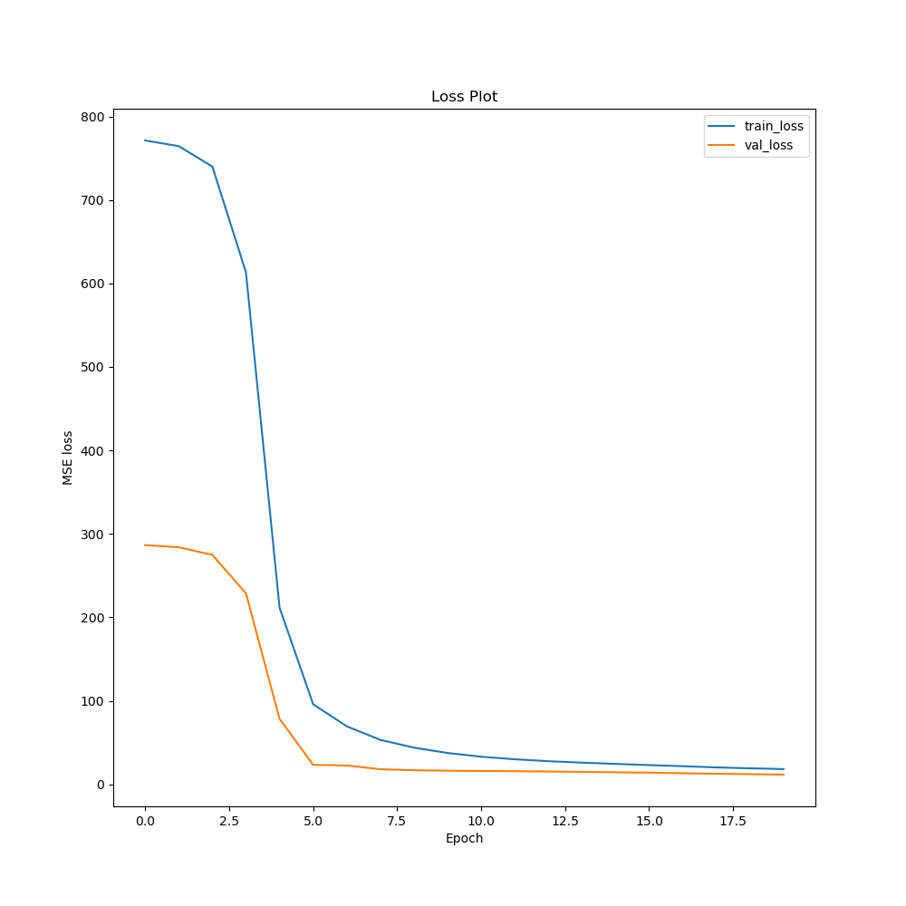

# building-efficiency-utility

## Exploratory Data Analysis
The dataset consisted of 768 samples, 8 features, and 2 outputs (heating load, and cooling load). A distribution of all the features was plotted. 

## Model Development & Training 

train loss: 7.910704612731934 val loss: 1.6574316024780273 test loss: 3.789883613586426

'''
x_train: (621, 8)
y_train: (621, 2)
x_val: (70, 8)
y_val: (70, 2)
x_test: (77, 8)
y_test: (77, 2)
'''
