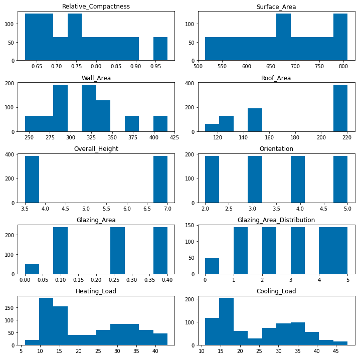

# building-efficiency-utility

## Exploratory Data Analysis
The dataset consisted of 768 samples, 8 features, and 2 outputs (heating load, and cooling load). A distribution of all the features was plotted. 

The correlation of each feature with the heating load and cooling load was plotted. 

The correlation of each feature with eachother was plotted. 

## Model Development & Training 
Since we have 2 outputs that are continuous variables, the the problem can be modeled as a muli-task regression. Using PyTorch, a model with the following structure
was created: 

The dataset was split into a training, validation, and test set with the following shapes: 
'''
x_train: (621, 8)
y_train: (621, 2)
x_val: (70, 8)
y_val: (70, 2)
x_test: (77, 8)
y_test: (77, 2)
'''
Since this is a regression problem, MSE loss is used. But how can MSELoss be used for a multi-task problem? One solution is to create 2 output heads in the network, compute MSELoss for both, then sum or average them. Luckily, PyTorch's torch.nn.MSELoss() can take in vectors and averages the MSELoss for each of their values for us. 
The model was trained for 20 epochs using the Adam optimizer, yielding a final training loss of 7.910704612731934, validation loss of 1.6574316024780273, and test loss of 3.789883613586426. 

